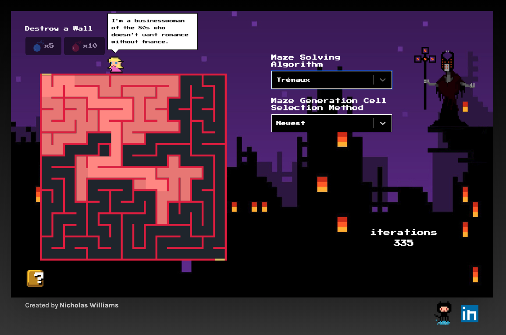

# Alaska: Trial of the Maze Wizard
+ A NES-inspired visualization of various [maze solving algorithms](https://en.wikipedia.org/wiki/Maze_solving_algorithm) and the newest addition to Alaska's bodacious interplanetary adventures!

### Features
+ User-configurable maze generation using the [Growing Tree algorithm](http://weblog.jamisbuck.org/2011/1/27/maze-generation-growing-tree-algorithm)
+ Four animated maze solving algorithms: Tremaux, Wall Follower, Breadth-First Search, and A*
+ Iteration counter
+ Interactive maze wall demolition
+ State-responsive UI animation

### Technologies
+ React
+ HTML5 Canvas

### Run it Yourself
+ `npm install`
+ `npm start`

### Future Features: Nothing's Ever Finished
+ **Separate UI and Algorithm Logic:** Currently, the canvas is drawn to *as* an algorithm is solving a given maze. By solving (or failing to solve) a given maze, storing each path taken, then drawing each path, the view and model are effectively separated and the UI becomes much more flexible.
+ Add Sound Effects
`.trim();